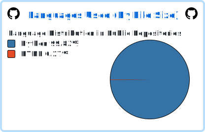

# 💫 About Me:
- **RU:** Бэкенд-разработчик на Python: создаю веб-приложения на `Flask` с использованием `SQLAlchemy/SQLite` и создаю Telegram-ботов на `aiogram3`

- **EN:** Python Backend Developer specializing in `Flask` web applications with `SQLAlchemy/SQLite` and crafting Telegram bots using `aiogram3`

# 💻 Tech Stack:
- 

- 

- 

#  GitHub Stats:
